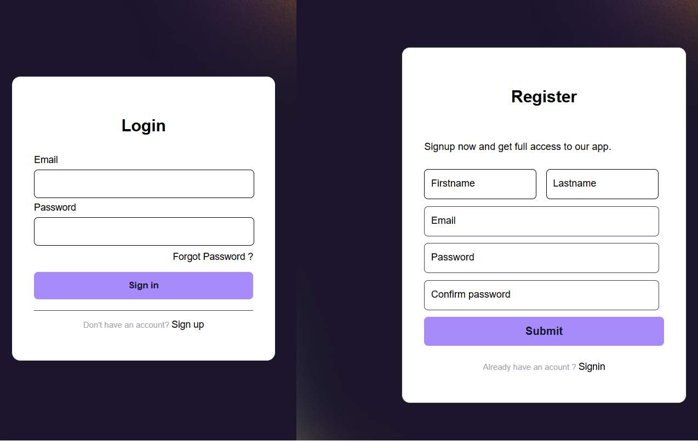
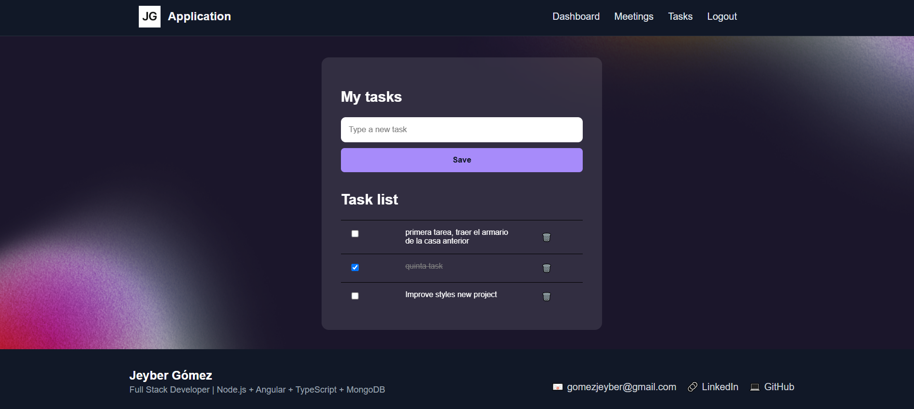
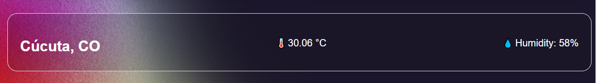

# 🌟 **JG Application — Smart Daily Dashboard**


## 🧠 Overview

**JG Application** is a modern web app built with **Angular 20 (frontend)** and **Node.js + Express (backend)**, designed to help users **organize their daily lives** in one place.

It allows users to manage **personal tasks**, **meetings**, and view **real-time weather updates** through a **dynamic, visual, and secure dashboard**.

> 💡 _The main goal of this project is to deliver an intuitive and visually appealing experience for daily planning, combining productivity, secure authentication, and personalized data visualization._

---

## 🧩 **Tech Stack**

### 🖥️ Frontend

- **Angular 20**
- **TypeScript**
- **HTML5 / SCSS**
- **RxJS / HttpClient**
- **Bootstrap / TailwindCSS**
- **Router Guards (protected routes)**

### ⚙️ Backend

- **Node.js + Express**
- **MongoDB (Mongoose ORM)**
- **JWT (secure authentication)**
- **bcrypt (password encryption)**
- **dotenv (environment variables)**
- **Custom CORS setup**

---

## ⚙️ **Main Features**

### 🔐 Authentication & Security

- User registration and login with **JWT (JSON Web Tokens)**.
- Each user manages their own data (tasks, meetings, profile).
- **Route protection** on both frontend and backend.
- Secure communication with **custom CORS configuration**.



---

### 📅 Meeting Module

- Create, edit, and list meetings.
- Fields include description, platform (Zoom, Meet, Teams), date, and time.
- Data validation and error handling.
- Visually integrated into the dashboard.


---

### ✅ Task Module

- Add, complete, or delete tasks.
- Auto-refresh without reloading the page.
- Minimalist design with smooth animations.
- Data persistence per user.



---

### 🌦️ Weather Module

- **Real-time weather information** based on the user's city.
- Displays temperature, humidity, and general conditions.
- Integrated with the **OpenWeatherMap API**.



---

### 💻 Personalized Dashboard

- Displays a combination of:
  - User profile (photo, name, profession).
  - Priority tasks.
  - Upcoming meetings.
  - Local weather data.
- **Dynamic dashboard** per user (`userId`).
- Responsive, modern, and elegant design.

## 

## 🧱 **Project Structure**

```bash
frontend/
 ├── src/
 │   ├── app/
 │   │   ├── auth_components/
 │   │   ├── services/
 │   │   ├── guards/
 │   │   ├── models/
 │   │   └── pages/
 │   ├── assets/
 │   └── environments/

backend/
 ├── src/
 │   ├── controllers/
 │   ├── models/
 │   ├── routes/
 │   ├── middlewares/
 │   └── config/

```

---

## **How to run the project**

### 🔧 Backend

cd backend
npm install
npm run dev

### 💻 Frontend

cd frontend
npm install
ng serve

---

## 🧑‍💻 Developed by

### 👨‍💻 Jeyber Gómez

Full Stack Developer | Angular + React + TypeScript + Python + Node.js + MongoDB + SQL/NoSQL

📧 gomezjeyber@gmail.com
🔗 Linkedin: https://www.linkedin.com/in/jeyber-adrian-gomez-g/
| GitHub: https://github.com/jeyber-g21
